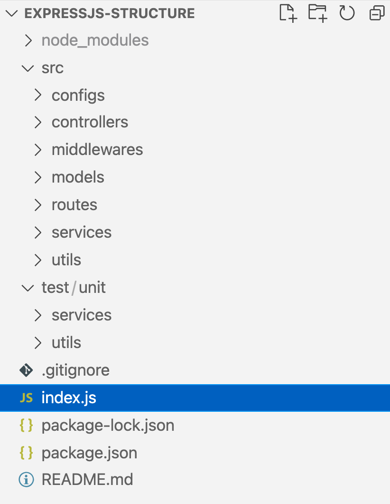

.. _structure:

=========================================
Express: structure de projet Expess.js 
=========================================

**Exemple de structure de projet Expess.js bien organisée**
____________________________________________________________

Pour un bon projet Web, par exemple, une API aura sûrement des routes et des contrôleurs. Il contiendra également des middleware 
comme l'authentification ou la journalisation. Le projet aura une logique pour communiquer avec le magasin de données, 
comme une base de données et une logique métier.

Ceci est un exemple de structure qui peut aider à organiser le code pour les choses que j'ai mentionnées ci-dessus. 
Je vais vous expliquer plus en détail comment j'ai organisé ce projet ci-dessous :

Plongeons plus profondément dans les dossiers principaux srcet testles sous-dossiers qu'ils contiennent. 
Le point d'entrée principal de cette application Express organisée est le fichier à la racine, qui peut être exécuté avec 
Node en utilisant pour démarrer l'application. Il nécessitera l'application Express et reliera les itinéraires avec 
les routeurs relatifs.index.jsnode index.js

Tout middleware sera également généralement inclus dans ce fichier. Ensuite, il démarrera le serveur.

Arborescence des dossiers
--------------------------

Dans l'image ci-dessus, vous verrez deux dossiers principaux : src contient le code source et test contient tout le code de 
test. Il est temps de creuser un peu plus dans les src sous - dossiers.

Tout d'abord, nous avons le configs dossier, qui conserve toutes les configurations nécessaires à l'application. Par exemple,
si l'application se connecte à une base de données, la configuration de la base de données (comme le nom de la base de données
et le nom d'utilisateur) peut être placée dans un fichier tel que . De même, d'autres configurations comme le nombre d'enregistrements 
à afficher sur chaque page pour la pagination peuvent être enregistrées dans un fichier nommé à l' intérieur de ce dossier.
db.config.jsgeneral.config.jsconfigs

Le dossier suivant est controllers, qui hébergera tous les contrôleurs nécessaires à l'application. Ces méthodes de contrôleur 
obtiennent la demande des routes et les convertissent en réponses HTTP à l'aide de n'importe quel middleware si nécessaire.

Par la suite, le middlewares dossier séparera tout middleware nécessaire à l'application en un seul endroit. Il peut y avoir 
un middleware pour l'authentification, la journalisation ou tout autre objectif.

Ensuite, nous avons le routes dossier qui contiendra un seul fichier pour chaque ensemble logique de routes. Par exemple, 
il peut y avoir des itinéraires pour un type de ressource. Il peut être décomposé en versions comme v1 ou v2 pour séparer 
les fichiers de route par la version de l'API.

Après cela, le models dossier contiendra les modèles de données requis pour l'application. Cela dépendra également du 
datastore utilisé s'il s'agit d'une base de données relationnelle ou non relationnelle (NoSQL). Le contenu de ce dossier 
sera également défini par l'utilisation d'une bibliothèque ORM (Object Relational Mapping) . Si un ORM comme Sequelize 
ou Prisma est utilisé, ce dossier aura des modèles de données définis selon ses besoins.

Par conséquent, le services dossier comprendra toute la logique métier. Il peut avoir des services qui représentent des objets
métier et peuvent exécuter des requêtes sur la base de données. Selon les besoins, même des services généraux comme une base 
de données peuvent être placés ici.

Dernier point mais non le moindre, nous avons le utilsrépertoire qui contiendra tous les utilitaires et aides nécessaires à 
l'application. Il servira également de lieu pour mettre la logique partagée, le cas échéant. Par exemple, une simple aide 
pour calculer le décalage d'une requête SQL paginée peut être placée dans un fichier de ce dossier.helper.util.js

Le test dossier contient des sous-dossiers comme unitet integrationpour les tests unitaires et d'intégration.

Le unit dossier à l'intérieur du testdossier aura une structure similaire au srcdossier, car chaque fichier du src dossier 
aura besoin d'un test, et il est préférable de suivre la même structure, comme ceci :

