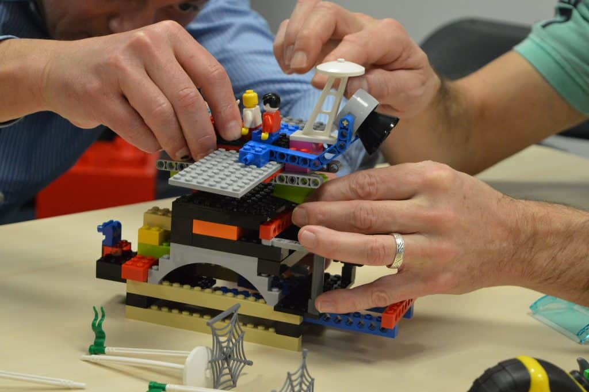

.. _composition:

==============================================================
programmation fonctionnelle:   Le pouvoir de la composition
==============================================================

**La philosophie de la composition**
____________________________________

Prérequis pour comprendre la composition

• Vous devez avoir joué avec Lego

Philosophie Lego
----------------

1. Toutes les pièces sont conçues pour être connectées
2. Les pièces sont réutilisables dans de nombreux contextes
3. Connectez deux pièces ensemble et obtenez une autre "pièce" qui peut toujours être connectée

        >> Si vous comprenez Lego alors vous savez tout sur la composition !

**Principes de programmation fonctionnelle**
_____________________________________________

1. Les fonctions sont des choses
2. Construisez de plus grandes fonctions en utilisant la composition
3. Les types ne sont pas des classes
4. Construisez des types plus gros en utilisant la composition

Fonctions et comment les composer
----------------------------------

1. idées de programmation fonctionnelle

* Une fonction est une chose qui transforme les entrées en sorties
* Une fonction est une chose autonome, non attachée à une classe
* Il peut être utilisé pour les entrées et les sorties d'autres fonctions
* Une fonction peut être une sortie
* Une fonction peut être une entrée
* Une fonction peut être un paramètre

2. Construire des fonctions plus grandes en utilisant la composition

.. code-block::

 int add1(int x) => x + 1;
 int times2(int x) => x * 2;
 int square(int x) => x * x;
 add1(5);                   // = 6
 times2(add1(5));          // = 12
 square(times2(add1(5))); // = 144
..

Types et comment les composer
----------------------------------

- un type est juste un nom pour un ensemble de choses

- Les types plus grands sont construits à partir de types plus petits en:
Composer avec "ET"
Composer avec "OU"

Composez avec "ET"
------------------
.. code-block::

 type AppleVariety = Red | Green
 type BananaVariety = Yellow | Brown
 type CherryVariety = Tart | Sweet
 type FruitSalad = {
 Apple: AppleVariety
 Banana: BananaVariety
 Cherry: CherryVariety
 }
..

Composez avec "OU"
------------------
.. code-block::

 type Snack =

 | Apple of AppleVariety

 | Banana of BananaVariety

 | Cherry of CherryVariety
.. 

Composition en pratique
-----------------------

Temps pour quelques exemples réels!

1. Technique I:COMPOSITION AVEC PIPING (CHIFFRES ROMAINS)

• Tâche : Comment convertir un entier arabe en chiffres romains ?
• 5 => "V"
• 12 => "XII"
• 107 => "CVII"

• Use the "tally" approach
- Start with N copies of "I"
- Replace five "I"s with a "V"
- Replace two "V"s with a "X"
- Replace five "X"s with a "L"
- Replace two "L"s with a "C"
- etc

.. code-block::

 let toRomanNumerals number =
 // define a helper function for each step
 let replace_IIIII_V str =
 replace "IIIII" "V" str
 let replace_VV_X str =
 replace "VV" "X" str
 let replace_XXXXX_L str =
 replace "XXXXX" "L" str
 let replace_LL_C str =
 replace "LL" "C" str
 // then combine them using piping
 String.replicate number "I"
 |> replace_IIIII_V
 |> replace_VV_X
 |> replace_XXXXX_L
 |> replace_LL_C
..

       >>Comment pouvons-nous composer deux fonctions quand l'une a une entrée et l'autre a deux entrées??

2.Technique II : COMPOSITION AVEC CURRYING(CHIFFRES ROMAINS)  

Mauvaise nouvelle :
les modèles de composition ne fonctionnent que pour les fonctions qui ont un seul paramètre!

Bonnes nouvelles! 
Chaque fonction peut être transformée en une fonction à paramètre unique

Qu'est-ce que le currying?

Le curry signifie que *chaque* fonction peut être convertie en une série de fonctions d'entrée

      >> pouvons-nous les composer avec currying et application partielle

      >>Comment pouvons-nous composer deux fonctions quand l'une a une entrée et l'autre a deux entrées??

3.Technique III : COMPOSITION AVEC BIND(FIZZBUZZ)  

Définition de FizzBuzz

Écrire un programme qui prend un nombre en entrée
• Pour les multiples de trois, imprimez «Fizz»
• Pour les multiples de cinq, imprimez «Buzz»
• Pour les multiples de trois et cinq, imprimez «FizzBuzz»
• Sinon, imprimez le numéro d'origine

.. code-block::

 let fizzbuzz n =
 n
 |> handle 15 "FizzBuzz"
 |> ifUnhandledDo (handle 3 "Fizz")
 |> ifUnhandledDo (handle 5 "Buzz")
 |> lastStep
..

